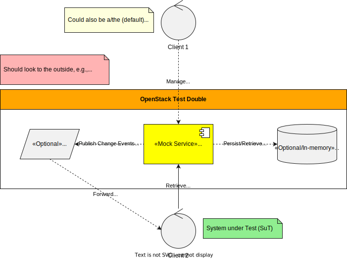

= OpenStack Mock Service
:toc: left
:toclevels: 2
:icons: font

This repository provides a small HTTP mock service to emulate selected OpenStack endpoints/behaviors for local development and testing.
It uses existing https://kops.sigs.k8s.io[kOps] OpenStack test mock functions.
The code is mostly glue code to expose these functions as a simple HTTP service.

[NOTE]
.LLM disclaimer
====
https://www.jetbrains.com/ai/[IntelliJ Junie LLM] created most of this codebase.
====

[plantuml, "Architecture Overview",svg]

== Prerequisites

* Go 1.25+ (as specified in xref:go.mod[])
* Make (optional but recommended)

== Build

Using Make (recommended):

----
make deps
make build
----

The build creates the binary at:

* bin/openstack-mock

Directly with Go (without Make):

----
go mod tidy
go build -o bin/openstack-mock .
----

== Run

Using Make:

----
make run
----

Directly:

----
./bin/openstack-mock
----

The service listens on 127.0.0.1:19090 by default.
You can change the bind address and port via flags:

`-listen`:: (default: `127.0.0.1`)
`-port`:: (default: `19090`)

Example:

[src,bash]
----
./bin/openstack-mock -listen 0.0.0.0 -port 19091
----

== Quick test

This repository provides a simple HTTP request collection in openstack.http (compatible with IntelliJ / GoLand / HTTP Client; standalone CLI: https://www.jetbrains.com/help/idea/http-client-cli.html[JetBrains HTTP Client CLI]).
You can use it to quickly test endpoints once the server is running.

== Development hints

* Format, vet, and test:
+
----
make fmt
make vet
make test
----

* Use a local kOps checkout via a `replace` in `go.mod`:
+
[source]
----
# In go.mod, point k8s.io/kops to your local path
replace k8s.io/kops => ../path/to/your/local/kops
----
+
TIP: You can also use go mod edit to set this programmatically:
+
[source,bash]
----
go mod edit -replace=k8s.io/kops=../path/to/your/local/kops
go mod tidy
----
+
A sample commented `replace` already exists in go.mod; adjust and uncomment it to match your local path.
+
[IMPORTANT]
====
Do not check in the `replace` directive in go.mod.
====
+
* Clean build artifacts:
+
----
make clean
----

== Docker build

This repository includes a multi-stage Dockerfile and Makefile targets to build and publish a multi-platform container image (linux/amd64 and linux/arm64) for the service.

Build and push a multi-platform image (with tags: latest and current branch):

----
make docker-build
----

Optionally, overriding the image name/registry (will push a multi-arch manifest and images for amd64+arm64):

----
IMAGE=ghcr.io/your-org/openstack-mock make docker-build
----

Alternative alias (same as docker-build):

----
IMAGE=ghcr.io/your-org/openstack-mock make docker-push
----

Notes:

* Platforms: The build creates images  for `linux/amd64` and `linux/arm64` using Docker _Buildx_ and pushed as a multi-arch manifest.
* Requirements: You need Docker Buildx enabled and a logged-in registry for pushing (e.g., `docker login ghcr.io`).
* Tagging: In addition to `latest`, the build adds the current git branch name as a tag. It sanitizes the name to be a valid Docker tag (lowercased, slashes/spaces to `-`, others mapped to `-`).
* Runtime: The container runs as non-root in a minimal distroless image, and the app listens on port 19090, binding to 0.0.0.0 inside the container.
* Run locally:
+
----
docker run --rm -p 19090:19090 ghcr.io/your-org/openstack-mock:latest
----
+
Then access the service at http://localhost:19090/

== License

This project is licensed under the GNU Affero General Public License v3.0 or later (AGPL-3.0-or-later).

* SPDX-License-Identifier: AGPL-3.0-or-later
* See the LICENSE file at the root of this repository for the full text.
